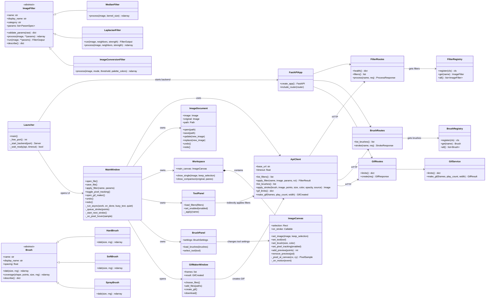
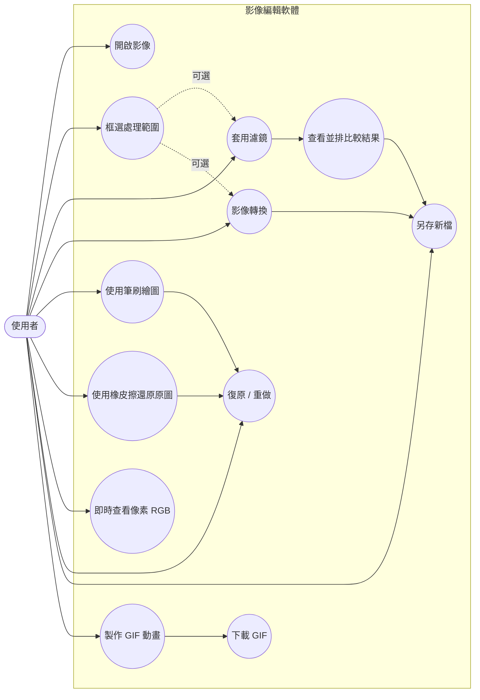
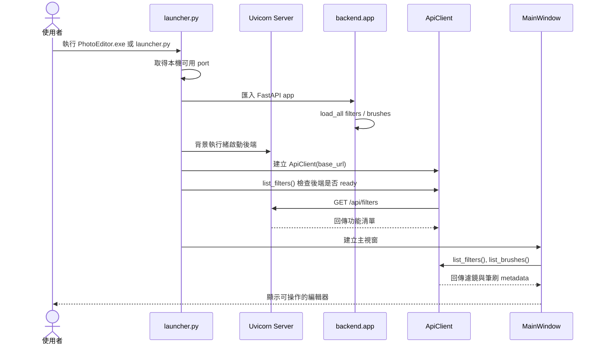
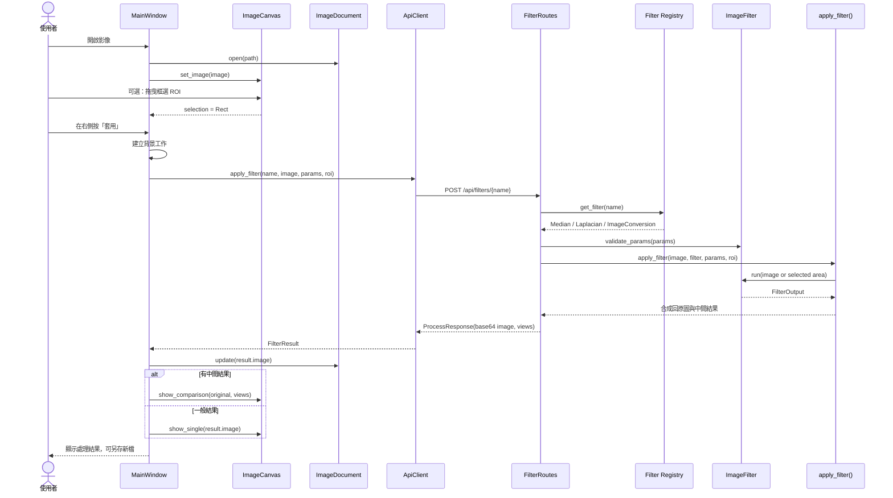
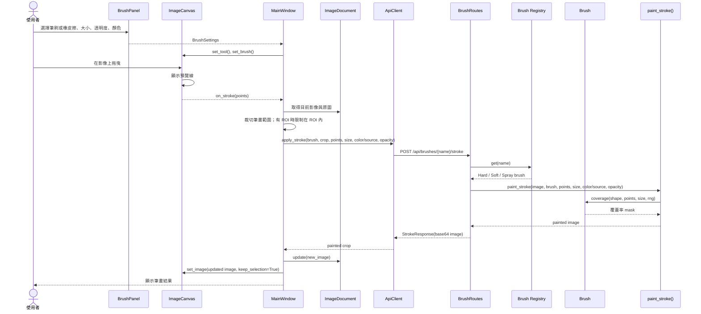
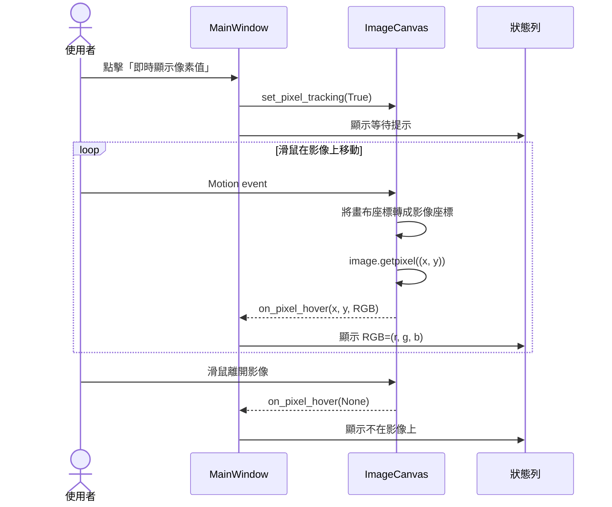
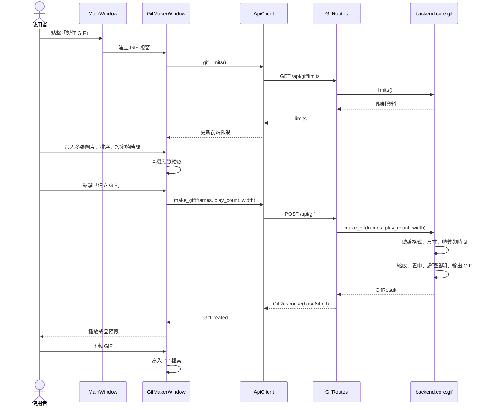

# 影像編輯軟體 UML 圖

本文件整理目前專案的主要設計圖，使用 Mermaid 語法撰寫，可在支援 Mermaid 的 Markdown 檢視器或 GitHub 上渲染。

## 類別圖

```mermaid
classDiagram
    direction LR

    class Launcher {
        +main()
        -_free_port() int
        -_start_backend(port) Server
        -_wait_ready(api, timeout) bool
    }

    class FastAPIApp {
        +create_app() FastAPI
        +include_router(router)
    }

    class ApiClient {
        +base_url: str
        +timeout: float
        +list_filters() list
        +apply_filter(name, image, params, roi) FilterResult
        +list_brushes() list
        +apply_stroke(brush, image, points, size, color, opacity, source) Image
        +gif_limits() dict
        +make_gif(frames, play_count, width) GifCreated
    }

    class MainWindow {
        +open_file()
        +save_file()
        +apply_filter(name, params)
        +toggle_pixel_tracking()
        +open_gif_maker()
        +undo()
        +redo()
        -_run_async(work, on_done, busy_text, quiet)
        -_queue_stroke(points)
        -_start_next_stroke()
        -_on_pixel_hover(sample)
    }

    class ImageDocument {
        +image: Image
        +original: Image
        +path: Path
        +open(path)
        +save(path)
        +update(new_image)
        +replace(new_image)
        +undo()
        +redo()
    }

    class Workspace {
        +main_canvas: ImageCanvas
        +show_single(image, keep_selection)
        +show_comparison(original, panes)
    }

    class ImageCanvas {
        +selection: Rect
        +on_stroke: Callable
        +set_image(image, keep_selection)
        +set_tool(tool)
        +set_brush(size, color)
        +set_pixel_tracking(enabled)
        +add_preview(points) int
        +remove_preview(pid)
        -_pixel_at_canvas(cx, cy) PixelSample
        -_on_motion(event)
    }

    class ToolPanel {
        +load_filters(filters)
        +set_enabled(enabled)
        -_apply(name)
    }

    class BrushPanel {
        +settings: BrushSettings
        +load_brushes(brushes)
        +select_tool(tool)
    }

    class GifMakerWindow {
        +frames: list
        +result: GifCreated
        +choose_files()
        +add_files(paths)
        +create_gif()
        +download()
    }

    class ImageFilter {
        <<abstract>>
        +name: str
        +display_name: str
        +category: str
        +params: list~ParamSpec~
        +validate_params(raw) dict
        +process(image, **params) ndarray
        +run(image, **params) FilterOutput
        +describe() dict
    }

    class MedianFilter {
        +process(image, kernel_size) ndarray
    }

    class LaplacianFilter {
        +run(image, neighbors, strength) FilterOutput
        +process(image, neighbors, strength) ndarray
    }

    class ImageConversionFilter {
        +process(image, mode, threshold, palette_colors) ndarray
    }

    class Brush {
        <<abstract>>
        +name: str
        +display_name: str
        +spacing: float
        +dab(size, rng) ndarray
        +coverage(shape, points, size, rng) ndarray
        +describe() dict
    }

    class HardBrush {
        +dab(size, rng) ndarray
    }

    class SoftBrush {
        +dab(size, rng) ndarray
    }

    class SprayBrush {
        +dab(size, rng) ndarray
    }

    class FilterRegistry {
        +register(cls) cls
        +get(name) ImageFilter
        +all() list~ImageFilter~
    }

    class BrushRegistry {
        +register(cls) cls
        +get(name) Brush
        +all() list~Brush~
    }

    class FilterRoutes {
        +health() dict
        +filters() list
        +process(name, req) ProcessResponse
    }

    class BrushRoutes {
        +list_brushes() list
        +stroke(name, req) StrokeResponse
    }

    class GifRoutes {
        +limits() dict
        +create(req) GifResponse
    }

    class GifService {
        +limits() dict
        +make_gif(frames, play_count, width) GifResult
    }

    Launcher --> FastAPIApp : starts backend
    Launcher --> MainWindow : opens UI
    MainWindow --> ApiClient : uses
    MainWindow --> ImageDocument : owns
    MainWindow --> Workspace : owns
    MainWindow --> ToolPanel : owns
    MainWindow --> BrushPanel : owns
    MainWindow --> GifMakerWindow : opens
    Workspace *-- ImageCanvas : contains
    ToolPanel --> ApiClient : indirectly applies filters
    BrushPanel --> ImageCanvas : changes tool settings
    GifMakerWindow --> ApiClient : creates GIF
    ApiClient --> FilterRoutes : HTTP
    ApiClient --> BrushRoutes : HTTP
    ApiClient --> GifRoutes : HTTP
    FastAPIApp --> FilterRoutes
    FastAPIApp --> BrushRoutes
    FastAPIApp --> GifRoutes
    FilterRoutes --> FilterRegistry : gets filters
    BrushRoutes --> BrushRegistry : gets brushes
    GifRoutes --> GifService
    ImageFilter <|-- MedianFilter
    ImageFilter <|-- LaplacianFilter
    ImageFilter <|-- ImageConversionFilter
    Brush <|-- HardBrush
    Brush <|-- SoftBrush
    Brush <|-- SprayBrush
```

## 使用者案例圖

```mermaid
flowchart LR
    user([使用者])

    subgraph app[影像編輯軟體]
        open((開啟影像))
        select_roi((框選處理範圍))
        apply_filter((套用濾鏡))
        convert_image((影像轉換))
        compare_result((查看並排比較結果))
        paint((使用筆刷繪圖))
        erase((使用橡皮擦還原原圖))
        inspect_pixel((即時查看像素 RGB))
        undo_redo((復原 / 重做))
        save((另存新檔))
        make_gif((製作 GIF 動畫))
        download_gif((下載 GIF))
    end

    user --> open
    user --> select_roi
    user --> apply_filter
    user --> convert_image
    user --> paint
    user --> erase
    user --> inspect_pixel
    user --> undo_redo
    user --> save
    user --> make_gif

    select_roi -.可選.-> apply_filter
    select_roi -.可選.-> convert_image
    apply_filter --> compare_result
    compare_result --> save
    convert_image --> save
    paint --> undo_redo
    erase --> undo_redo
    make_gif --> download_gif
```

## 循序圖：啟動應用程式

```mermaid
sequenceDiagram
    actor User as 使用者
    participant Launcher as launcher.py
    participant Uvicorn as Uvicorn Server
    participant App as backend.app
    participant API as ApiClient
    participant UI as MainWindow

    User->>Launcher: 執行 PhotoEditor.exe 或 launcher.py
    Launcher->>Launcher: 取得本機可用 port
    Launcher->>App: 匯入 FastAPI app
    App->>App: load_all filters / brushes
    Launcher->>Uvicorn: 背景執行緒啟動後端
    Launcher->>API: 建立 ApiClient(base_url)
    Launcher->>API: list_filters() 檢查後端是否 ready
    API->>Uvicorn: GET /api/filters
    Uvicorn-->>API: 回傳功能清單
    Launcher->>UI: 建立主視窗
    UI->>API: list_filters(), list_brushes()
    API-->>UI: 回傳濾鏡與筆刷 metadata
    UI-->>User: 顯示可操作的編輯器
```

## 循序圖：套用濾鏡或影像轉換

```mermaid
sequenceDiagram
    actor User as 使用者
    participant UI as MainWindow
    participant Canvas as ImageCanvas
    participant Doc as ImageDocument
    participant Client as ApiClient
    participant Routes as FilterRoutes
    participant Registry as Filter Registry
    participant Filter as ImageFilter
    participant ROI as apply_filter()

    User->>UI: 開啟影像
    UI->>Doc: open(path)
    UI->>Canvas: set_image(image)
    User->>Canvas: 可選：拖曳框選 ROI
    Canvas-->>UI: selection = Rect
    User->>UI: 在右側按「套用」
    UI->>UI: 建立背景工作
    UI->>Client: apply_filter(name, image, params, roi)
    Client->>Routes: POST /api/filters/{name}
    Routes->>Registry: get_filter(name)
    Registry-->>Routes: Median / Laplacian / ImageConversion
    Routes->>Filter: validate_params(params)
    Routes->>ROI: apply_filter(image, filter, params, roi)
    ROI->>Filter: run(image or selected area)
    Filter-->>ROI: FilterOutput
    ROI-->>Routes: 合成回原圖與中間結果
    Routes-->>Client: ProcessResponse(base64 image, views)
    Client-->>UI: FilterResult
    UI->>Doc: update(result.image)
    alt 有中間結果
        UI->>Canvas: show_comparison(original, views)
    else 一般結果
        UI->>Canvas: show_single(result.image)
    end
    UI-->>User: 顯示處理結果，可另存新檔
```

## 循序圖：筆刷與橡皮擦

```mermaid
sequenceDiagram
    actor User as 使用者
    participant BrushPanel as BrushPanel
    participant Canvas as ImageCanvas
    participant UI as MainWindow
    participant Doc as ImageDocument
    participant Client as ApiClient
    participant Routes as BrushRoutes
    participant Registry as Brush Registry
    participant Brush as Brush
    participant Core as paint_stroke()

    User->>BrushPanel: 選擇筆刷或橡皮擦、大小、透明度、顏色
    BrushPanel-->>UI: BrushSettings
    UI->>Canvas: set_tool(), set_brush()
    User->>Canvas: 在影像上拖曳
    Canvas->>Canvas: 顯示預覽線
    Canvas-->>UI: on_stroke(points)
    UI->>Doc: 取得目前影像與原圖
    UI->>UI: 裁切筆畫範圍；有 ROI 時限制在 ROI 內
    UI->>Client: apply_stroke(brush, crop, points, size, color/source, opacity)
    Client->>Routes: POST /api/brushes/{name}/stroke
    Routes->>Registry: get(name)
    Registry-->>Routes: Hard / Soft / Spray brush
    Routes->>Core: paint_stroke(image, brush, points, size, color/source, opacity)
    Core->>Brush: coverage(shape, points, size, rng)
    Brush-->>Core: 覆蓋率 mask
    Core-->>Routes: painted image
    Routes-->>Client: StrokeResponse(base64 image)
    Client-->>UI: painted crop
    UI->>Doc: update(new_image)
    UI->>Canvas: set_image(updated image, keep_selection=True)
    UI-->>User: 顯示筆畫結果
```

## 循序圖：即時顯示像素值

```mermaid
sequenceDiagram
    actor User as 使用者
    participant UI as MainWindow
    participant Canvas as ImageCanvas
    participant Status as 狀態列

    User->>UI: 點擊「即時顯示像素值」
    UI->>Canvas: set_pixel_tracking(True)
    UI->>Status: 顯示等待提示
    loop 滑鼠在影像上移動
        User->>Canvas: Motion event
        Canvas->>Canvas: 將畫布座標轉成影像座標
        Canvas->>Canvas: image.getpixel((x, y))
        Canvas-->>UI: on_pixel_hover(x, y, RGB)
        UI->>Status: 顯示 RGB=(r, g, b)
    end
    User->>Canvas: 滑鼠離開影像
    Canvas-->>UI: on_pixel_hover(None)
    UI->>Status: 顯示不在影像上
```

## 循序圖：製作 GIF

```mermaid
sequenceDiagram
    actor User as 使用者
    participant Main as MainWindow
    participant GifUI as GifMakerWindow
    participant Client as ApiClient
    participant Routes as GifRoutes
    participant Service as backend.core.gif

    User->>Main: 點擊「製作 GIF」
    Main->>GifUI: 建立 GIF 視窗
    GifUI->>Client: gif_limits()
    Client->>Routes: GET /api/gif/limits
    Routes->>Service: limits()
    Service-->>Routes: 限制資料
    Routes-->>Client: limits
    Client-->>GifUI: 更新前端限制
    User->>GifUI: 加入多張圖片、排序、設定幀時間
    GifUI->>GifUI: 本機預覽播放
    User->>GifUI: 點擊「建立 GIF」
    GifUI->>Client: make_gif(frames, play_count, width)
    Client->>Routes: POST /api/gif
    Routes->>Service: make_gif(frames, play_count, width)
    Service->>Service: 驗證格式、尺寸、幀數與時間
    Service->>Service: 縮放、置中、處理透明、輸出 GIF
    Service-->>Routes: GifResult
    Routes-->>Client: GifResponse(base64 gif)
    Client-->>GifUI: GifCreated
    GifUI-->>User: 播放成品預覽
    User->>GifUI: 下載 GIF
    GifUI->>GifUI: 寫入 .gif 檔案
```
